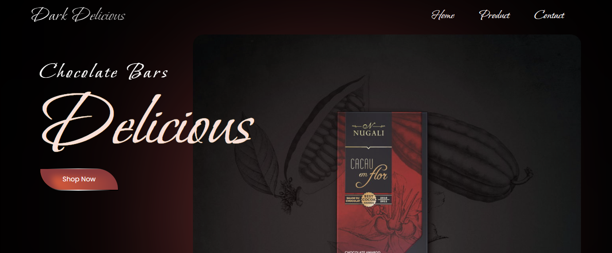

<h1 align="center"> Chocolate Bars </h1>

## Tecnologias 🚀 
Esse projeto foi desenvolvido com as seguintes tecnologias:
- React
- Tailwind
- Next Js

### Objetivo
- Responsividade
- Renderização SSG
- Componetização

##  Layout 🔖
No link abaixo você encontra o layout que inspirou o projeto:
- [Layout](https://www.figma.com/community/file/1076612207781052174)

## Vercel 
No link abaixo você encontra um demo da aplicação rodando na Vercel
- [Vercel](https://chocolate-bars.vercel.app/)

Feito com ♥ by [Wilson Felipe](https://github.com/Wfelipe2011)

